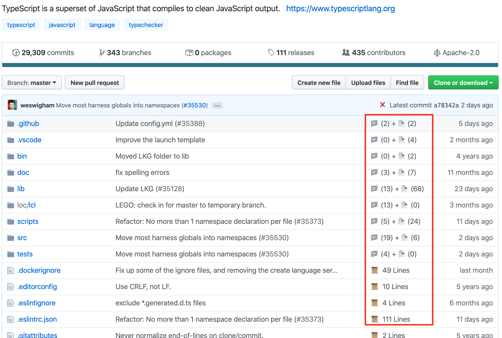
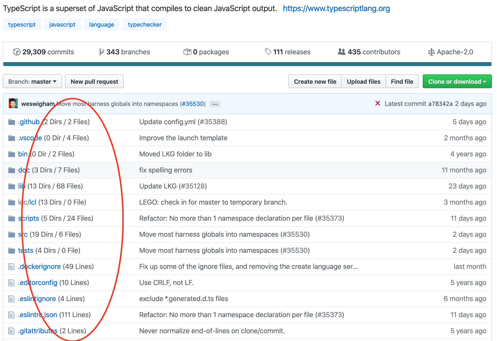

# 👀 Octopeek: Save yourself useless clicks 🖱️ when navigating GitHub

## Usage

1. You are navigating GitHub.
2. You click a folder to see if it has the file you are looking for, only to find out that the folder is empty.
3. You click a text file to see its content and see that it has zero (or very few) lines.
4. You just wasted your click.
5. More importantly, the time it took to render the page you clicked into and the time it took to go back to the previous page were wasted.

Created out of my laziness to avoid unnecessarily clicking into uninteresting files/folders.

## Options

### Emoji (Default)
On your Chrome menu bar, click this icon: 🖌️

### Text

On your Chrome menu bar, click this icon: ✏️

